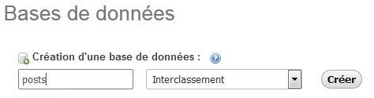
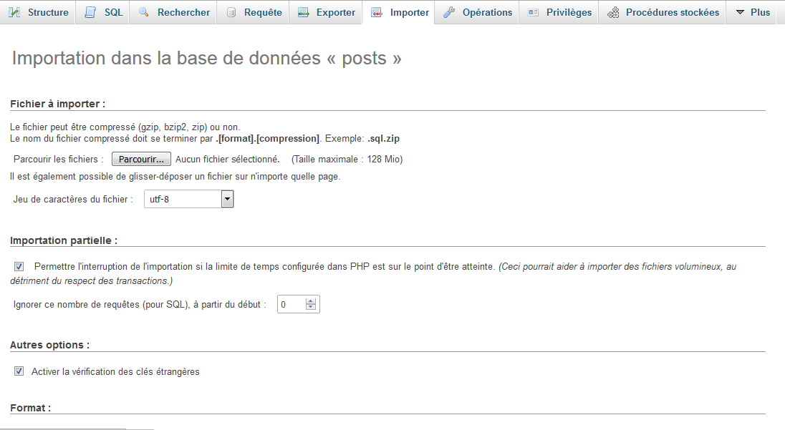
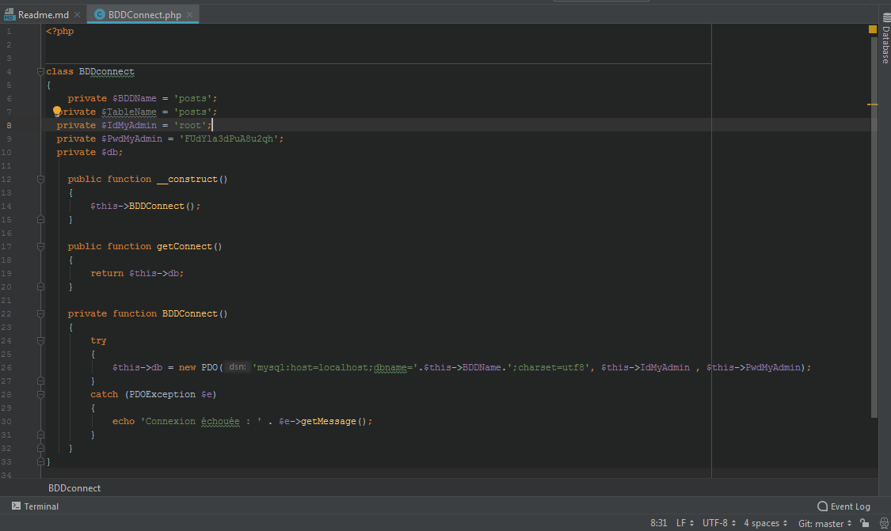
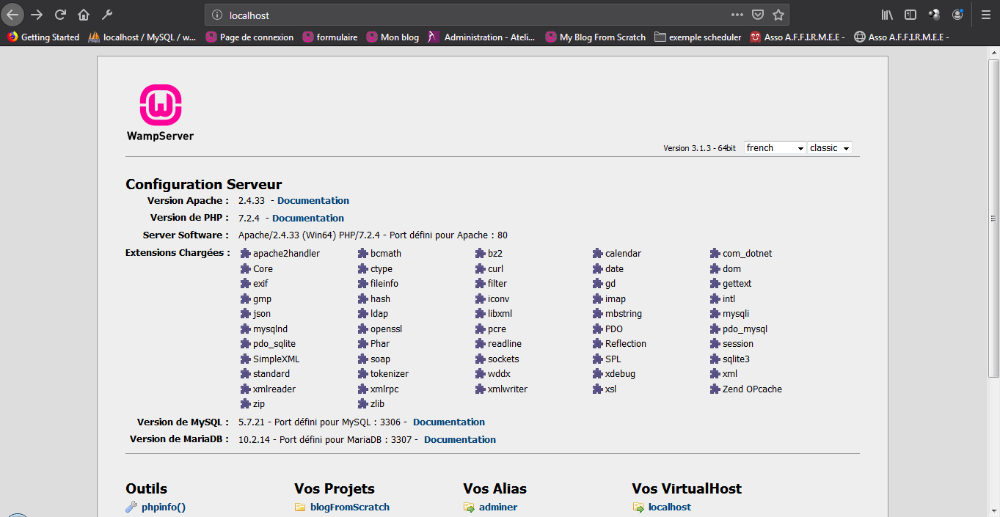
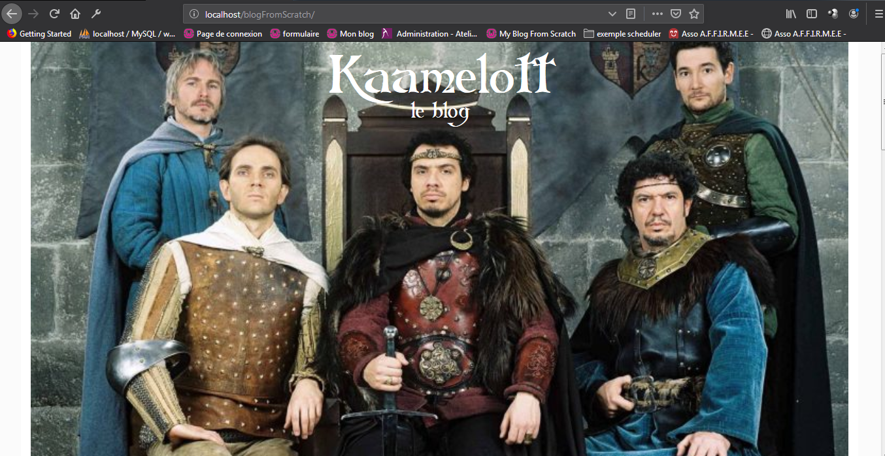
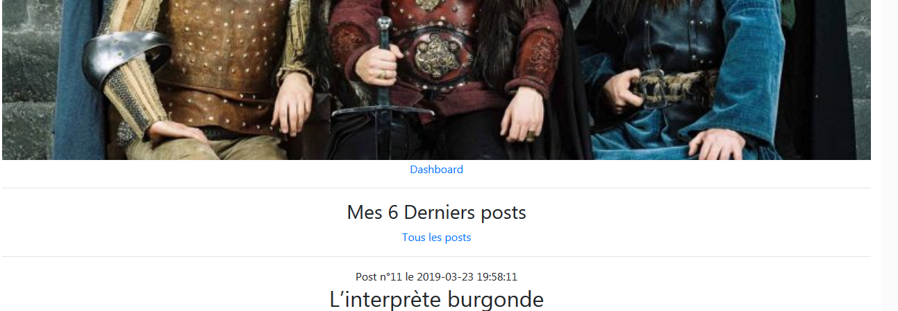

  
by Perriercreatif

Module Simplon Online
========


PHP blog with an MVC architecture (Model - View - Controller) and OOP (Object Oriented Programming)!


Summary
--------
* Operating instructions


instructions
--------------------
* Place the folder in your www folder and then activate your server (WAMP, LAMP...)

* Create your database



* Import post.sql 



* Change the following lines with your personal data the file BDDConnect.php in the Controller folder:



```
class BDDconnect
{
    ...
    private $IdMyAdmin = 'yourPhpMyAdminID'; 
    private $PwdMyAdmin = 'yourPassword';
    ...
```

* Type localhost in your browser
  
  

* Go get the blogFromScratch folder



* Click on Dashboard and connect with these login details (You can change them in the Controller folder in the login.php file)


```
    define('LOGIN','superelien');
    define('PASSWORD','tarzan');

```

Now here you could explore the blog created, modify or delete as you wish.

